# Team Information Portal - Visual Diagrams

This document contains ASCII art diagrams and Mermaid diagram code that can be rendered into actual images.

## How to Use These Diagrams

### Method 1: Mermaid Live Editor
1. Copy the code blocks below
2. Go to https://mermaid.live/
3. Paste and edit
4. Export as PNG/SVG

### Method 2: VS Code Extension
1. Install "Markdown Preview Mermaid Support" extension
2. Preview this file in VS Code
3. Right-click diagram → Export

### Method 3: GitHub Markdown
- GitHub automatically renders Mermaid diagrams in markdown files

---

## Diagram 1: System Architecture Overview

---

## Diagram 2: Content Flow (RAG Pipeline)

```mermaid
sequenceDiagram
    participant User
    participant Frontend
    participant API
    participant RAG
    participant VectorDB
    participant LLM
    
    User->>Frontend: Types question
    Frontend->>API: Send via WebSocket
    API->>RAG: Process query
    
    RAG->>RAG: Embed query
    RAG->>VectorDB: Similarity search
    VectorDB-->>RAG: Top 5 relevant chunks
    
    RAG->>RAG: Assemble context
    RAG->>LLM: Generate response with context
    
    loop Streaming
        LLM-->>RAG: Stream tokens
        RAG-->>API: Stream tokens
        API-->>Frontend: Stream tokens
        Frontend-->>User: Display incrementally
    end
    
    User->>Frontend: 👍/👎 Feedback
    Frontend->>API: Log feedback
```

---

## Diagram 3: Page Layout Structure

---

## Diagram 4: Deployment Architecture

---

## Diagram 5: Content Organization

---

## Diagram 6: Data Flow - User Query

---

## Diagram 7: Responsive Layout Breakpoints

---

## Diagram 8: AI Agent Training Pipeline

---

## Diagram 9: Security Architecture

---

## Diagram 10: 10-Week Implementation Timeline

---

## Additional Visual Resources

### Wireframe Templates
For actual wireframes, use tools like:
- **Figma**: https://www.figma.com
- **Excalidraw**: https://excalidraw.com (for quick sketches)
- **draw.io**: https://app.diagrams.net (for technical diagrams)

### Icon Resources
- **Lucide Icons**: https://lucide.dev
- **Font Awesome**: https://fontawesome.com
- **Heroicons**: https://heroicons.com

### Color Palette Visualization
Generate color swatches at:
- **Coolors**: https://coolors.co
- **Adobe Color**: https://color.adobe.com

### Mockup Tools
- **Figma** (recommended): Full design system
- **Sketch**: Mac-only design tool
- **Adobe XD**: Design and prototyping

---

## How to Create High-Fidelity Mockups

### Step 1: Set up Figma
1. Create new file: "Team Portal Design"
2. Set up frames for each breakpoint:
   - Desktop: 1920×1080
   - Tablet: 768×1024
   - Mobile: 375×667

### Step 2: Create Design System
1. Define color styles from UI_UX_DESIGN.md
2. Create text styles (headings, body, etc.)
3. Set up spacing components
4. Create reusable components:
   - Buttons
   - Cards
   - Input fields
   - Navigation items

### Step 3: Build Layouts
1. Header component
2. Sidebar navigation
3. Content area templates
4. AI chat interface
5. Footer component

### Step 4: Create Interactions
1. Hover states
2. Click states
3. Animation prototypes
4. Page transitions

### Step 5: Export Assets
1. Export icons as SVG
2. Export images as WebP/PNG
3. Generate CSS variables
4. Create style guide document

---

## Mermaid Diagram Cheat Sheet

**Node Types:**
- `[Text]` - Rectangle
- `(Text)` - Rounded rectangle
- `{Text}` - Diamond (decision)
- `((Text))` - Circle
- `[(Text)]` - Database
- `([Text])` - Stadium

**Arrow Types:**
- `-->` - Solid arrow
- `-.->` - Dotted arrow
- `==>` - Thick arrow
- `--Label-->` - Labeled arrow

---

**Document Version**: 1.0  
**Last Updated**: November 19, 2025  
**Tools Used**: Mermaid.js, ASCII Art  
**Next Step**: Create high-fidelity mockups in Figma
